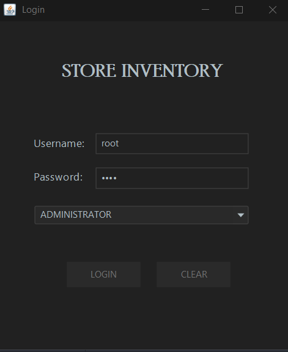
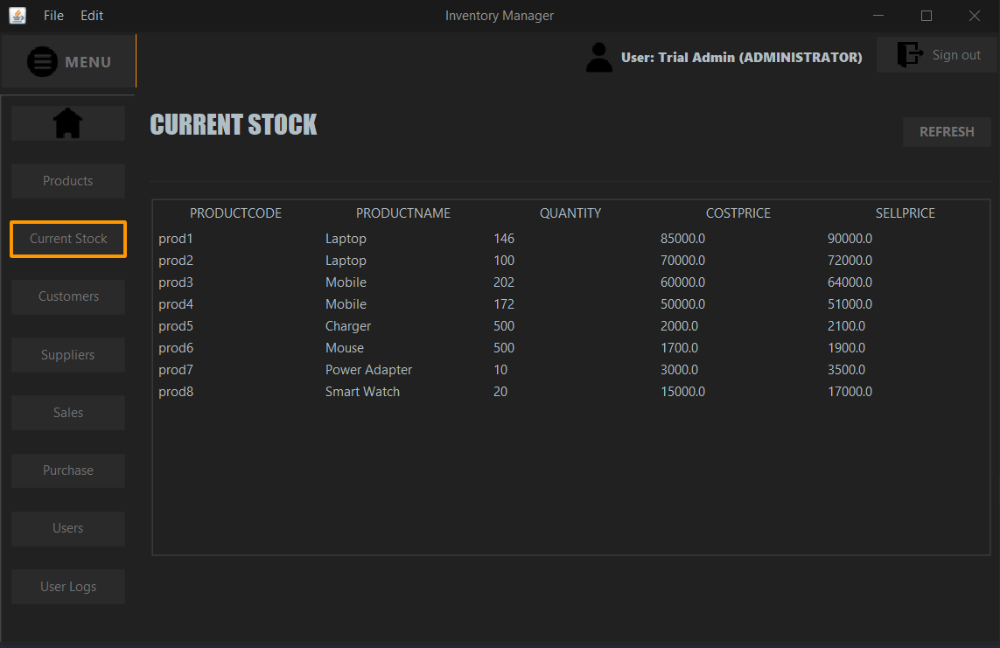

# Inventory Management System

An **Inventory Management System** designed to help businesses efficiently manage products, suppliers, customers, sales, purchases, stock, and users. This system provides a user-friendly interface for handling everyday inventory tasks, ensuring that your business stays organized and up-to-date.

## Features

- **User Authentication:** Secure login and logout functionality.
- **Product Management:** Add, update, and track products.
- **Supplier Management:** Manage supplier information and purchase orders.
- **Customer Management:** Track customer details and sales history.
- **Purchase & Sales:** Record purchase and sales transactions.
- **Stock Management:** Monitor inventory levels in real time.
- **User Management:** Administer user accounts and roles.
- **Logs:** Maintain an activity log for traceability.
- **Database Design:** Well-structured ER Diagram for database schema.

## Screenshots

### Entity Relationship Diagram


### Welcome/Login/Logout




### Dashboard Views
#### Products


#### Suppliers


#### Customers


#### Purchases


#### Sales


#### Stock Overview


#### User Management


#### Logs


## Getting Started

1. **Clone the repository:**
   ```bash
   git clone https://github.com/dhiraj7kr/inventory-management-system.git
   cd inventory-management-system
   ```

2. **Install dependencies:**  
   _Instructions will depend on your technology stack (Node.js, Python, etc.). Please update accordingly._

3. **Set up the database:**  
   _Import the provided SQL scripts or follow the schema in the ER diagram._

4. **Configure environment variables:**  
   _Update configuration files as per your local setup._

5. **Run the application:**  
   _Start your server or application as per the framework you're using._

## Contributing

Contributions are welcome! Please fork this repository and submit a pull request for any enhancements or bug fixes.

## License

This project is open-source. See the [LICENSE](LICENSE) file for details.

---

