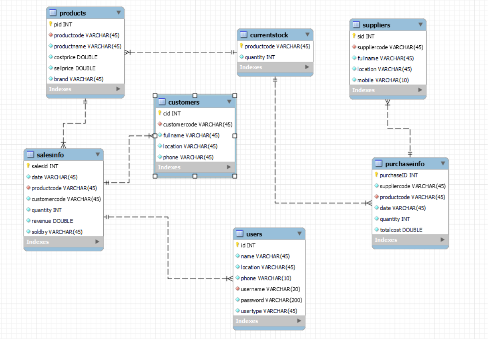

# Inventory Management System

Welcome to the **Inventory Management System** — a robust desktop GUI application built using ***Java*** and ***MySQL*** for managing inventory and transactions in small to mid-sized retail stores.

> This project is maintained by [@dhiraj7kr](https://github.com/dhiraj7kr).

---

## 🔧 Tech Stack

- **Java (JDK 16)** — Core programming language
- **Swing** — GUI framework
- **MySQL** — Relational database
- **JDBC** — Database connectivity
- **NetBeans / IntelliJ IDEA** — Development environment

---

## 🚀 Features

- 🧾 **Manage Products, Customers, Suppliers, Users, and Transactions**
- 🔐 **User Authentication** — Supports two roles:
  - **Administrator** (full access)
  - **Employee** (limited access)
- 📦 **Stock Management** — Automated update of stock after transactions
- 🔍 **Search Functionality** in each module
- ⚡ **Fast Data Entry** — Just enter the product code; rest is auto-filled
- 📅 **User Logs** — Tracks login and logout activity

---

## 📁 Download & Run

### ✅ Minimum Requirement: JDK or JRE version 16

1. **Download & Extract**
   - [Download ZIP Folder](InventoryManagement.zip)
2. **Import SQL Schema**
   - Download [InventoryDB.sql](SQL/InventoryDB.sql)
   - Import via MySQL Workbench or CLI
3. **Edit Database Credentials (if needed)**
   - Navigate to: `lib/DBCredentials.xml`
   - Change username/password:
     ```xml
     <properties>
       <comment>Credentials for the database.</comment>
       <entry key="username">root</entry>
       <entry key="password">root</entry>
     </properties>
     ```
4. **Run the Application**
   - Open the `InventoryManagement.jar` file
   - Default login:
     - Username: `root`
     - Password: `root`

> ⚠️ Ensure MySQL service is running before launching the application.

---

## 📸 Application Preview

| Module | Screenshot |
|--------|------------|
| **Login Page** |  |
| **Dashboard** |  |
| **Products** |  |
| **Stock** |  |
| **Suppliers** |  |
| **Customers** |  |
| **Sales** |  |
| **Purchases** |  |
| **User Management** (Admin only) |  |
| **User Logs** |  |

---

## 🗃️ Database Design

### 📌 ER Diagram



---

## 📦 Project Structure

The code is divided into the following Java packages:

- `dao` — Data Access Object layer (SQL interaction)
- `dto` — Data Transfer Object layer (data modeling)
- `database` — Connection and credential handling
- `ui` — GUI components

> [Browse Full Source Code ➜](https://github.com/dhiraj7kr/inventory-management-system/tree/main/src/com/inventory)

---

## 📌 Dependencies

All required libraries are located inside the [`lib`](lib/) folder.

---

## 🚧 Work In Progress

This project is actively maintained and more features are in the pipeline, including:
- Invoice generation
- Report export (PDF/CSV)
- Improved UI with JavaFX

---

## 📬 Contact

For any issues or suggestions, feel free to reach out or open an issue.

Maintained with ❤️ by [@dhiraj7kr](https://github.com/dhiraj7kr)

---

